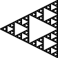
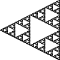
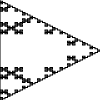
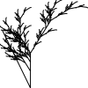
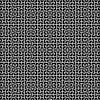
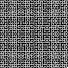
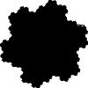
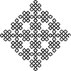
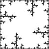

# L-systems in Rust

Render [L-systems](https://en.wikipedia.org/wiki/L-system) as [SVGs](https://en.wikipedia.org/wiki/SVG) using [Rust](https://www.rust-lang.org/) and [Cairo](https://www.cairographics.org/).

Some useful resources on getting started:

- https://en.wikipedia.org/wiki/L-system
- https://fedimser.github.io/l-systems.html
- https://paulbourke.net/fractals/lsys/

## Usage

This tool has a command line interface:

```
Visualize 2D L-Systems with SVGs.

Usage: lsys [OPTIONS] --width <WIDTH> --height <HEIGHT> <AXIOM> <VARIABLES_TO_DRAW> <ANGLE> <ITERATIONS> [RULES]...

Arguments:
  <AXIOM>              Initial string
  <VARIABLES_TO_DRAW>  Variables that should be treated as a stroke and drawn
  <ANGLE>              Turn angle in degrees
  <ITERATIONS>         Number of times the rules will run
  [RULES]...           Rules for replacing characters with a new string (i.e. "F=>F+F")

Options:
      --width <WIDTH>    Width of the SVG Canvas in millimeters
      --height <HEIGHT>  Height of the SVG Canvas in millimeters
  -o, --out <FILE>       Path to write the SVG to
  -h, --help             Print help
  -V, --version          Print version
```

To draw four iterations of the [Koch snowflake](https://en.wikipedia.org/wiki/Koch_snowflake) on a 100mm x 100m SVG:

```
cargo run --release -- --width 100 --height 100 'F++F++F' 'F' 60 4 'F=>F-F++F-F' -o out.svg
```

## Examples

Many of the systems below come from [Paul Bourke's site](http://paulbourke.net/fractals/lsys/).

### Sierpinski Triangle


### Sierpinski Arrowhead


### Koch Curve


### Dragon Curve


### Fractal Plant


### Moore Curve


### Hilbert Curve


### Sierpinski Carpet


### Koch Snowflake


### Hexagonal Gosper


### Kolam


### Crystal

